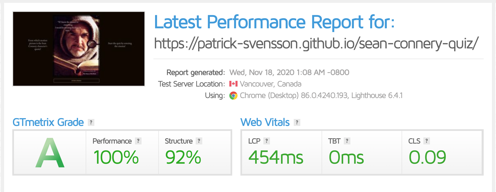
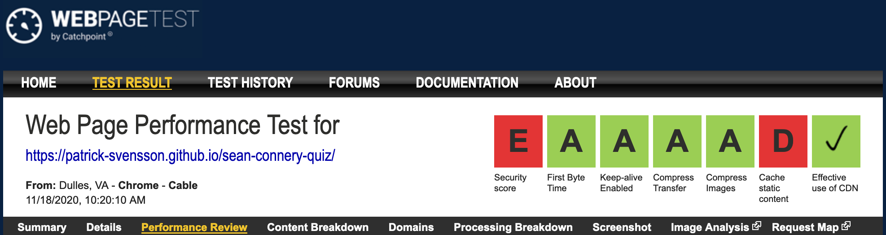

# Sean Connery Movie Quotes Quiz


**A quiz game created as a tribute to Sir Thomas Sean Connery for his great performances on the big screen.
The goal is to connect a quote, made by a Sean Connery movie character, to the corresponding film title from where the quote was taken.
Points are given for each correct answer.**

## UX

*   To all Sean Connery fans, as well as others, this quiz was made to help us remember the brilliant actor that he was,
    and, for just a moment...in our minds, recall that pronounced accent with his so characteristic sh-sounds.
    And, of courshe (sorry, just couldn't resist), to enjoy the pleasure of a simple (yet sometimes difficult) quiz game.

*   The expected user would be interested in movies in general and of Sean Connery in particular.

*   By trying to select the corresponding film title to the displayed character quote, 
    the user will, in his/her mind, get to recall and experience that particular sequence of the picture,
    and therefore enhence their memory of the late star.

*   The user would want clear instructions of what to do and how to navigate in the application.
    Therefore, a short but distinct description of what the quiz is about will be displayed on the landing page.
    The clearly defined buttons will then guide the user to achieve his/her goal.


*   If there is a delay when the Game Board is being loaded, the user would want to know what to expect.
    An animated "loader" is displayed to let the user know that the page is loading.

*   When the user has selected a film title, she/he would expect a confirmation of whether or not the selection was correct.
    The color of film title buttons will respond to the selection.

*   The user would want to know the progress of the quiz and how many quotes there are left to be displayed. 
    A quote counter is displayed for that purpose at the top of the page.

*   The user would want to know when the quiz is over.
    When the last quote has been used the user is directed to the End Page.

*   The user would want to be able to see the number of correct answers.
    The progress of the score is displayed at the top of the page.

*   At the end of the quiz, the user would want to know the total score.
    The total score is displayed on the End Page when the final quote has been answered.

*   Having finished the quiz, the user would want to be given the option of exiting the quiz or try again.
    The user can go back to the Landing Page by clicking the Exit Cinema button or click the Restart Quiz button to try the quiz again. 

*   The user would want to feel the connection to the cinema and the motion pictures.
    A red cinema screen curtain and content in gold colour, all set on a dark background will provide a cinematic effect.

*   The aim is toward a neat and cinematic design, with the focus upon the quiz game and the character's quotes.

*   Wireframes can be viewed [here](wireframes/sean-connery-movie-quote-quiz.pdf)

## Features

*   Landing Page
    *   A button with the text Enter Cinema.
        
    *   On nontouchpad screens, the button will respond to mouse hover with a glowing effect and expanding slightly.
        
    *   On touchpad screens the button will respond to a click action with a glowing effect and expanding slightly.
    
    *   Clicking the button the user will be directed to the Game Board and presented with a quote from a motion picture
        in which Sean Connery had an acting role.

*   Game Board

    *   Displaying a "loader" whilst the page is loading.

    *   At the top left side of the page, there is a counter which will show the number of quotes that has been used out of the total amounts of quotes.

    *   At the top right side of the page, the current score is displayed. 

    *   A Sean Connery character quote is presented upon a cinema screen curtain. The quotes will automatically update when the user has selected an answer.
    
    *   Four buttons with film titles.
        
    *   On nontouchpad screens, the button will respond to mouse hover with a glowing effect and expanding slightly.
        
    *   On touchpad screens the button will respond to a click action with a glowing effect and expanding slightly.
        
    *   The clicked button will "glow" green for a correct answer or red for an incorrect answer till the next quote is displayed.

    *   When the user has reached the final quote of the quiz she/he will be directed to the End Page

*   End Page

    *   On top of the page the final score is displayed.

    *   The text "The End" is displaed on the cinema curtain.

    *   A button with the text Restart Quiz.
        
    *   On nontouchpad screens, the button will respond to mouse hover with a glowing effect and expanding slightly.
        
    *   On touchpad screens the button will respond to a click action with a glowing effect and expanding slightly.

    *   Clicking the Restart Quiz button will take the user back to the Game Board.

    *   A button with the text Enter Cinema.
        
    *   On non touch pad screens the button will respond to mouse hover with a glowing effect and expanding slightly.
        
    *   On touch pad screens the button will respond to a click action with a glowing effect and expanding slightly.
    
    *   Clicking the Exit Cinema button will take the user back to the Landing Page.

### Features Left to Implement

*   Take the quotes from the previously used quotes out of the restarted quiz.

## Technologies Used

*   HTML5, CSS3, and javaScript

*   Bootstrap 4
    *   For gird layout and responsivity.

*   Google Fonts
    *   To access their font-family library.

*   Tiny.png
    *   To compress images.

*   Smallpdf.com
    *   Smallpdf.com

*   Balsamiq
    *   To create wireframes.

*   Auto Prefixer
    *   Adding vendor prefixes to CSS.


## Testing

*   Markup Validation Service [(link)](https://validator.w3.org/)
    *   Choose Validate by Direct Input.
    *   Copy Paste the HTML into the validator.
    *   index.HTML Test result:
        *  No Warnings
    *   quiz.HTML Test result:
        *   Warning: Empty heading.
        *   From line 31, column 29; to line 31, column 77
        *   Heading text will be added with javaScript. 
    *   end.html Test result:
        *   Warning: Empty heading.
        *   From line 23, column 25; to line 23, column 66
        *   Heading text will be added with javaScript.

*   CSS Validation Service [(link)](https://jigsaw.w3.org/css-validator/)
    *   Choose By direct input.
    *   Copy Paste the CSS into the validator.
    *   index.css Test result:
        *  No Error Found
    *   quiz.css Test result:
        *  No Error Found    
    *   end.css Test result:
        *  No Error Found

*   jshint [(link)](https://jshint.com/) JavaScript Code Test.
    
    *   Copy the JavaScript code and paste it into the js hint website.
    *   The result will be displayed in the column nex to your code.
    *   There should be no errors and severe warnings.
    *   Test result: 36 Warnings:
        *   15  'const' is available in ES6 (use 'esversion: 6') or Mozilla JS extensions (use moz).
        *   6 	'let' is available in ES6 (use 'esversion: 6') or Mozilla JS extensions (use moz).
        *   10  'arrow function syntax (=>)' is only available in ES6 (use 'esversion: 6').
        *   1   'spread operator' is only available in ES6 (use 'esversion: 6').
        *   2   'template literal syntax' is only available in ES6 (use 'esversion: 6').
        *   2   ['number'] is better written in dot notation.
    *   Three undefined variables:
        *   2 	startQuiz
        *   3   getNewQuote
        *   2   incrementScore
    *   Test result after adding ```/*jshint esversion: 6*/``` to the files:
        *   2   ['number'] is better written in dot notation.
*   Lighthouse
    *   Rightclick on the webpage and hit inspect. Click >> button on top bar. Select Lighthouse. Click the Generate report button.
    *   Greens icons equal good results. The higher percentage the better.
    *   Test result:


    

*   Am I responsive [(link)](http://ami.responsivedesign.is/) Multiple Device Mockup Generator

*   Troy [(link)](http://troy.labs.daum.net/) Viewport Responsivity Test.
    *  Copy-paste the URL
    *   Test result:
        *   Image too large on small desktops
        *   Text overflowing the cinema screen on wide screens.
        *   Issues fixed with media queries.

*   GTmetrix [(link)](https://gtmetrix.com/) Loading Test.
        *  Copy paste the URL
        *   Test result:
        

    

*   WEBPAGETEST by Catchpoint [(link)](https://webpagetest.org/) Web Page Performance Test
        *  Copy paste the URL
        *   Test result:

    

*   Pineberry [(link)](https://www.pineberry.com/) SEO Analysis Tool
    *   Copy paste the URL, enter the desired search keyword, enter your email address
        *   Test result: [(link)](https://www.pineberry.com/en/analysis-tool/result/sLNDVn8HnwQ_/)

*   Prepostseo [(link)](https://www.prepostseo.com/grammar-checker) Grammar-checker

*   Bugfix
    *   The game could not detect the correct answer to the quotes. Every selected answer rendered incorrect.
    *   My excellent mentor showed me how to find bugs in js using console.log to be able to squoosh them.
    *   Using console.log the bug was found on line 85.
    *   Changed ```selectedAnswer == currentQuote.correctAnswer ? "correct" : "incorrect";``` to ```selectedAnswer == currentQuote.answer ? "correct" : "incorrect";```.

*   Family and friends tested the different user story scenarios as well as UX and UI.

*   The application has been tested successfully in Edge, Safari, Chrome, and Firefox.

## Deployment

*   To make my website accessible to the public I deployed it on Github .
    * I did so by:
        *   Logging in to Github
        *   Going to my Milestone 2 Project Sean-Connery-Quiz on my repository page
        *   Go to settings
        *   Scroll down to Github Pages
        *   click on source
        *   select none
        *   select main (previously master) branch, Root
        *   click Save
        *   Wait for the page to refresh
        *   scroll down to Github Pages once more
        *   Find Site URL and copy it.
* Git clone

    *   The "clone" command downloads an existing Git repository to a local computer. There are different options for cloning a repository, but this walkthrough will only cover the Url option, which is the most frequently used option. You need to have downloaded and installed Git on to your computer. Make sure to allow Git to be used from the command line in the installation process.
    *   Create a folder for storing the repository locally.
    *   Open your web browser and enter the GitHub repository’s URL.
    *   Click on the button, “Code”, on right side of the screen, below the “Security” tab
    *   Open the Command Prompt (on Windows) or Terminal (on Mac).
    *   In the terminal, navigate to the location in which you would like to store the repository by typing the following command: ```$ cd <name of directory>```
    *   To clone the repo. Enter the following command: ```$ git clone <name of repo-url>```
    *   Make sure that the repository is in the dedicated folder on your computer. If so, then the repository was successfully cloned to your “Git local” folder.
    *   For a full tutorial or to find other options to clone a repository than by Url, please visit this Git Tutorial.

## Credits

*   James Q Quick for javaScript
    *   Youtube Tutorial: Build a Quiz App with HTML, CSS, and JavaScript by James Q Quick [(link)](https://www.youtube.com/watch?v=u98ROZjBWy8&list=PLDlWc9AfQBfZIkdVaOQXi1tizJeNJipEx&index=1&ab_channel=JamesQQuick)

*   lauraedw/pen/RPOoJy for Loader
    *   Codepen [(link)](https://codepen.io/lauraedw/pen/RPOoJy)

    *    https://codepen.io/lauraedw/pen/RPOoJy

*   Stack overflowing for help with media queries.

*   Brian Macharia for the great mentor that he is.

*   Helena Plantin for all the help, support, and love she gives me.

### Content

*   Quotes Copied from:
    *   QC [(link)](https://quotecatalog.com/communicator/sean-connery)
    *   moviequotes.com [(link)](https://www.moviequotes.com/quotes-by/sean-connery/)
    *   Classic Movie Hub [(link)](http://www.classicmoviehub.com/bio/sean-connery/)

### Media

*   Images
    *   Shutterstock [(link)](https://www.shutterstock.com/sv/image-vector/vintage-golden-border-isolated-on-dark-1723469248)
        *   Silent Movie Frame ID: 17234692248 By backUp
    *   Alamy [(link)](https://www.alamy.com/stock-photo-der-name-der-rose-f-i-d-1986-jean-jacques-annaud-mit-seinem-novizen-114269170.html?pv=1&stamp=2&imageid=D6BE0D2B-53DD-45FF-8E2B-3672E4ABFB18&p=1238327&n=0&orientation=0&pn=1&searchtype=0&IsFromSearch=1&srch=foo%3Dbar%26st%3D0%26sortby%3D2%26qt%3Dsean%2520connery%2520william%2520von%2520baskerville%26qt_raw%3Dsean%2520connery%2520william%2520von%2520baskerville%26qn%3D%26lic%3D3%26edrf%3D0%26mr%3D0%26pr%3D0%26aoa%3D1%26creative%3D%26videos%3D%26nu%3D%26ccc%3D%26bespoke%3D%26apalib%3D%26ag%3D0%26hc%3D0%26et%3D0x000000000000000000000%26vp%3D0%26loc%3D0%26ot%3D0%26imgt%3D0%26dtfr%3D%26dtto%3D%26size%3D0xFF%26blackwhite%3D%26cutout%3D%26archive%3D1%26name%3D%26groupid%3D%26pseudoid%3D%26userid%3D%26id%3D%26a%3D%26xstx%3D0%26cbstore%3D1%26resultview%3DsortbyPopular%26lightbox%3D%26gname%3D%26gtype%3D%26apalic%3D%26tbar%3D1%26pc%3D%26simid%3D%26cap%3D1%26customgeoip%3D%26vd%3D0%26cid%3D%26pe%3D%26so%3D%26lb%3D%26pl%3D0%26plno%3D%26fi%3D0%26langcode%3Den%26upl%3D0%26cufr%3D%26cuto%3D%26howler%3D%26cvrem%3D0%26cvtype%3D0%26cvloc%3D0%26cl%3D0%26upfr%3D%26upto%3D%26primcat%3D%26seccat%3D%26cvcategory%3D*%26restriction%3D%26random%3D%26ispremium%3D1%26flip%3D0%26contributorqt%3D%26plgalleryno%3D%26plpublic%3D0%26viewaspublic%3D0%26isplcurate%3D0%26imageurl%3D%26saveQry%3D%26editorial%3D1%26t%3D0%26edoptin%3D%26filters%3D0)
        *   Sean Connery William von Baskerville ID: DXK1JY By Ronald Grant Archive


## Acknowledgments

*   Great many thank's to Family and friends who helped with the testing.
*   To everyone out on Slack For help and support.
*   To Tutor Support for aid and guidance.